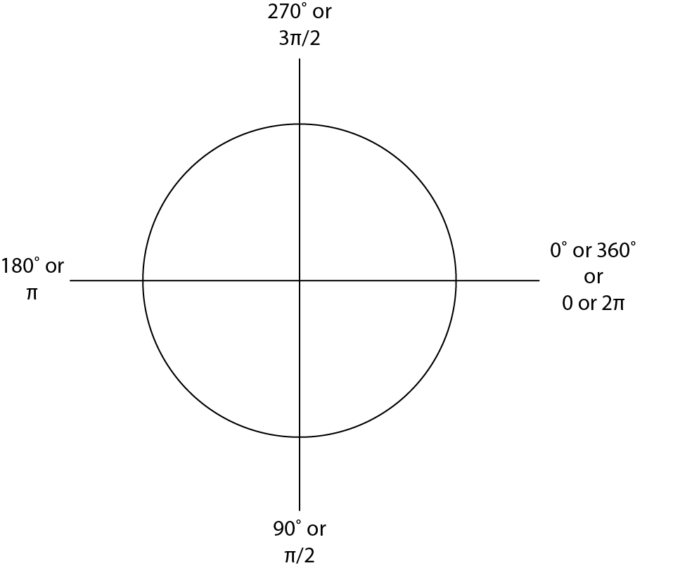

#ICM Help Sessions
with Kat & Craig

####Are we missing notes? Was something not explained clearly? Looking for an example of something and not finding it? Create an [issue](https://github.com/katsully/icm-help-sessions/issues) and let us know!

##Week 4

What is an object? 
An **object** is a collection of properties, a property is an association between a name (or key) and a value.

How do arrays works? 
Let's say you have an array called *data*.

~~~~
data =  []
data[0] = 698
data [1] = 743
data[2] = 84
~~~~

This creates a structure where at index 0 the value will be 698, index 1 the value will be 743, etc.

| 0 | 1 | 2 |
|---|---|---|
|698|743|84 |

#####Degrees and Radians
When talking about units of degrees, most people are more familiar with degrees (0 to 360), but in P5 we use radians. Instead of 0 to 360, in radians, the range is 0 to 2*PI.  

Another thing to note is that zero starts at the most right hand point of the circle.

##Week 5

#####Constructor Functions vs Object Literals

We have two ways to create an object.

1. Constructor Functions
2. Object Literals

A constructor function is written like so:

~~~~
function Person(first, last) {
   this.first = first;
   this.last = last;
}
~~~~

This is a more dynamic way of creating objects because we can create many objects, each with different values for the first and last property.

~~~~
var kat = new Person("Kat", "Sullivan");
var craig = new Person("Craig", "Pickard");
~~~~

Where as with an object literal, it's more of a container of data

~~~~
var kat = {
   first: "kat",
   last: "sullivan"
}
~~~~

#####Prototypes

Every Javascript object has a **prototype**.

   * Prototype is also an object

All Javascript objects inherit their properties and their methods from their prototype.

Most of you are use to creating functions for an object in the constructor function

~~~~
function Person(first, last) {
   this.first = first;
   this.last = last;
   this.getName = function() {
      return this.first + " " + this.last;
   }
}
~~~~

However, with this way of defining a function, you are redeclaring this function everytime you create a new Person object which isn't very efficient. To only create the getName function once, and have it be available to every Person object, we are going to use the Person object's prototype.

~~~~
Person.prototype.getName = function() {
   return this.firstName + " " + this.last;
}
~~~~

By adding onto the Person prototype, we only initialize the getName function once, and all Person objects have access to this function.

#####Vectors

Often when dealing with location or speed, you have two variables.

~~~~
var locationX;
var locationY;
~~~~

However, with two variables for everything (or three if you're dealing with three dimensions) you soon find yourself with a lot of variables. To handle this (and to get the ability to use vector math), we use vectors. So our previous code becomes:

`var location;`

With `location.x` being the same thing as `locationX`.

##Week 6

#####HTML
**H**yper **T**ext **M**arkup **L**anguage tags represent elements which are the building block of your webpage. 

#####DOM
**D**ocument **O**bject **M**odel is the HTML that gets parsed to create your webpage. 

#####Functions and Callbacks
I've always described functions as verbs and objects as nouns and said they are two different things, but in Javascript, functions can also objects.

woah

This means functions can be stored in variables, passed as arguments to functions, created within function, and returned from functions.

Callback functions are a technique that is part of functional programming. Basically, functional programming lets you use functions as arguments. While JavaScript is *not*, it does use callback functions.

So what is a callback function?
A function that is passed to another function as a parameter and the callback function is called. 

~~~~
var button = select('#button'); // get the HTML element with id 'button'

button.mousePressed(doSomething); // doSomething is the callback function

// doSomething is a function we write that will get called whenever someone presses the button
function doSomething(){
  // some code
}
~~~~

When we pass a callback as an argument to another function, we are only passing the callback function definition. We aren't executing the callback function inside the function. So it's
`button.mousePressed(doSomething);` 
NOT `button.mousePressed(doSomething());` 

Why?

We are not executing the function in the parameter. Which means the function is not executed immediately (it may seem immediate to you), it is "called back" at some point in the mousePressed function using the the function definition.

##Week 7

#####JSON
**J**ava**S**cript **O**bject **N**otation - it's 'easy' to read and write for humans (that's debatable) and it's very easy for machines to parse and generate.

JSON text format is the same regardless of if you're using P5, Processing, Cinder, Python, or any other language.

 

##Week 8

#####API
**A**pplication **P**rogram **I**nterface can be used to interact with software applications, such as Facebook, the New York Times, Youtube, Google Maps, etc. With APIs you can retrieve data, send messages to the client (ie Tweet from a Twitterbot), & so much more! APIs are basically a set of rules that govern how one application talks to another (ie how your P5 sketch asks Twitter for data or how Yelp uses Google maps to show where your favorite restaurant is).  

But procede with caution...
Just because a company has an API today, doesn't mean it will be available tomorrow. For example, a major component of my ICM final was based on gathering public data from Facebook's API, however on the morning of my final, Facebook changed their API and you could no longer query public data. 

##Week 9

#####Videos

Why do I need to use video.hide() in setup?

You'll notice that if you don't use the hide function in setup you'll see your video next to or underneath your canvas. This is because the createVideo function creates a video HTML element, just like createButton or createP, and just like a new button or new paragraph, this doesn't happen on top of the canvas but next to the canvas.